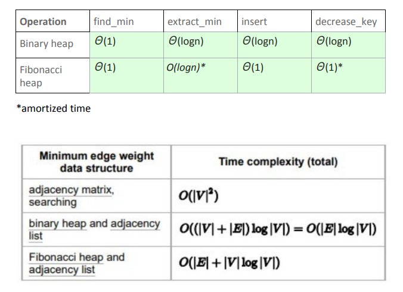
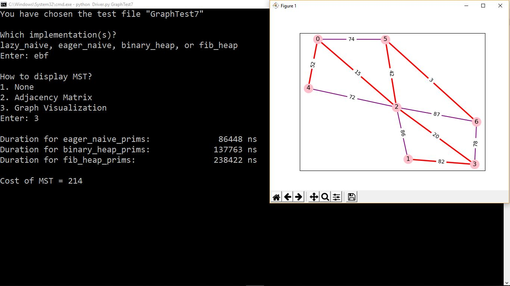
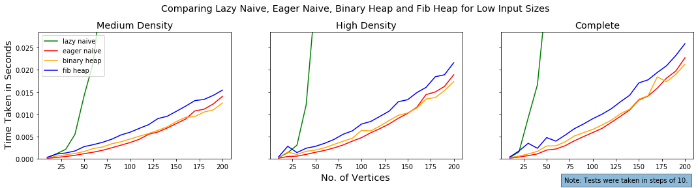
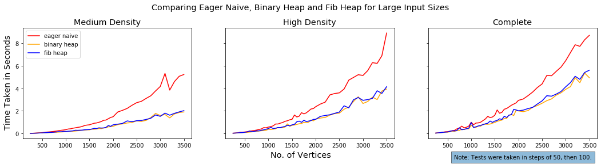

# Performance Comparison of Prim's Algorithm 
> With different priority queues, one of which is the Fibonacci heap.

# About
- [Prim's algorithm](https://en.wikipedia.org/wiki/Prim's_algorithm) is one of a few algorithms to find the minimum spanning tree of an undirected graph. 
- The algorithm uses a priority queue, and much of its time complexity depends on the priority queue used. 
- This project compares the performances of Prim's algorithm using different priority queues.

	1. Using Adjacency Matrix and Traversal (aka Eager Naive implementation)
	2. Using Adjacency Lists and a Binary Heap
	3. Using Adjacency Lists and a [Fibonacci Heap](https://brilliant.org/wiki/fibonacci-heap/)
- For much more detail, refer to the [project report](./Material/Project Report.pdf).

# Time Complexities



# Demo Screenshot



# Observations & Conclusions
- We generated hundreds of undirected connected graphs of different densities and ran them through our implementations.

## Low Input Sizes

For low input sizes (10 to 200), the Fibonacci heap implementation took much more time than the other two. The eager naive approach took slightly lesser time than the binary heap implementation until the input size of approximately 160 vertices.

## Large Input Sizes

For large input sizes (250 to 3500), the two heap implementations have more or less the same duration. The eager naive approach proves to be very inefficient when the input size exceeds 1000 vertices.

## Expectation
Since the Fibonacci heap implementation has a better time complexity than the others, we expected that it would take the least amount of time for very large graphs. But, it looks like we will need larger test cases to reach that threshold. We tried with an input size of 10,000 but the program ran out of memory.

# Installation

## Installing Dependencies
Needs Python3 (Python 3.7 was used for development.)
Needs matplotlib and networkx, both of which can be installed using pip.

## Installing the Project
Clone this repository using
```git init```

```git clone https://github.com/arunkumaraqm/Prims-Algorithm-Using-Fibonacci-Heap.git```

# Usage
`cd` into the folder and run the command
```python Driver.py```
or
```python Driver.py GraphTest1```
You may use any of the testfiles provided in the folder that you desire to replace GraphTest1. Please refer to the demo screenshot on how to provide further inputs.

# Contribute

Not currently looking for any contributions to this project.

# License

MIT license.
